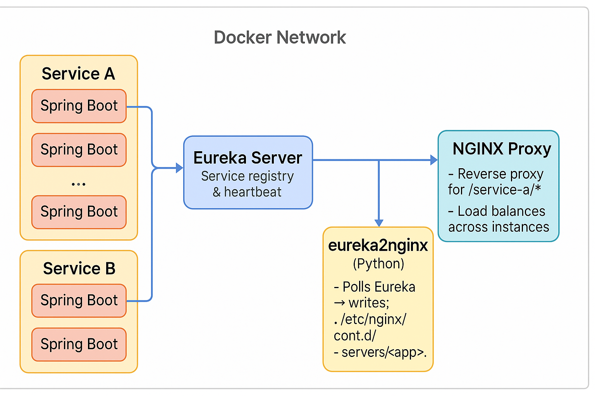

# Why-Kubernetes-Why


> Dynamic Service Discovery + NGINX Reverse Proxy via Eureka and Sidecar Automation
> A pragmatic exploration of why Kubernetes exists, starting with a dynamic, self-updating microservices system running purely on Docker.

---

## Overview

This project demonstrates a microservices architecture built using:

Why-Kubernetes-Why is a complete, containerized microservices playground that explores:

* **Spring Boot + Eureka** for **service discovery**
* **NGINX** for **server-side load balancing**
* **Python sidecar (`eureka2nginx`)** for **dynamic configuration generation**
* **Docker Compose** for container orchestration

When new service instances register with **Eureka**, the sidecar polls the registry, rebuilds the NGINX configuration dynamically, and reloads NGINX to route requests correctly — **no manual reconfiguration needed**.

---

## Architecture



```text
┌────────────────────────────────────────────┐
│             Docker Network                 │
│                                            │
│  ┌─────────────┐       ┌─────────────┐     │
│  │ Service A   │       │ Service B   │     │
│  │ (3 replicas)│       │ (3 replicas)│     │
│  │ Spring Boot │       │ Spring Boot │     │
│  └──────┬──────┘       └──────┬──────┘     │
│         │                     │            │
│         ▼                     ▼            │
│     ┌──────────────────────────────┐       │
│     │         Eureka Server        │       │
│     │  Service registry & heartbeat│       │
│     └──────────────────────────────┘       │
│                  ▲                         │
│                  │                         │
│     ┌──────────────────────────────┐       │
│     │  eureka2nginx (Python)       │       │
│     │  Polls Eureka → writes:      │       │
│     │   - /etc/nginx/conf.d/       │       │
│     │     upstreams/<app>.conf     │       │
│     │     servers/<app>.conf       │       │
│     └──────────────────────────────┘       │
│                  │                         │
│                  ▼                         │
│     ┌───────────────────────────────────┐  │
│     │          NGINX Proxy              │  │
│     │  - Reverse proxy for /service-a/* │  │
│     │  - Load balances across instances │  │
│     └───────────────────────────────────┘  │
│                                            │
└────────────────────────────────────────────┘
```

---

## Key Features

* **Dynamic upstream discovery:** No static IPs — NGINX reconfigures on the fly via Eureka data.
* **Horizontal scaling:** Add or remove service replicas — NGINX detects and updates routes automatically.
* **Hybrid-friendly:** Works when services are local or containerized.
* **Modular config:** Separate `/upstreams` and `/servers` directories prevent reload conflicts.
* **Automatic reload:** NGINX hot-reloads when new configs are written (via `inotifywait` or manual reload).

---

## Directory Structure

```bash
.
├── services/
│   ├── eureka-server/           # Eureka registry
│   ├── servicea/                # Spring Boot service A
│   └── serviceb/                # Spring Boot service B
│
├── infra/
│   ├── nginx/
│   │   ├── nginx.conf           # Main NGINX config (upstreams+servers order)
│   │   ├── conf.d/
│   │   │   ├── servers/         # Dynamic per-app server blocks
│   │   │   └── upstreams/       # Dynamic per-app upstreams
│   │   ├── Dockerfile           # Custom NGINX with reloader
│   │   └── reloader.sh          # Watches conf.d/* and reloads NGINX on change
│   │
│   ├── eureka2nginx/
│   │   ├── app.py               # Polls Eureka & regenerates config
│   │   └── Dockerfile
│   │
│   └── docker-compose.yml       # Orchestrates entire infra stack
│
└── README.md
```

---

## Quick Start

### Build and start the infrastructure

```bash
docker compose up --build
```

This brings up:

* `infra-nginx`
* `infra-eureka2nginx`
* `eureka-server`

### Launch services

Build and run service containers (or scale them):

```bash
docker compose up -d --scale services-service-a=3 --scale services-service-b=3
```

Eureka will automatically detect and register all instances.

### Verify registration

```bash
curl -s http://localhost:8761/eureka/apps | jq '.applications.application[].name'
```

Expected output:

```
"SERVICE-A"
"SERVICE-B"
```

---

## Test Routing

```bash
curl http://localhost/service-a/hello
curl http://localhost/service-b/hello
```

Output:

```
Hello from Service A - service-a-2
Hello from Service B - service-b-1
```

Run multiple times to confirm load balancing:

```bash
for i in {1..6}; do curl -s http://localhost/service-b/hello; echo; done
```

Each hit alternates between your service replicas.

---

## Scaling

To scale horizontally:

```bash
docker compose up -d --scale services-service-a=5 --scale services-service-b=4
```

Within 10 seconds:

* Eureka registers new instances
* `eureka2nginx` regenerates `/etc/nginx/conf.d/upstreams/*.conf`
* NGINX reloads automatically

### Verify NGINX sees all replicas:

```bash
docker exec infra-nginx-1 nginx -T | grep -A2 "upstream service-b"
```

Expected:

```nginx
upstream service-b {
    server 172.18.0.7:8082;
    server 172.18.0.8:8082;
    server 172.18.0.9:8082;
    server 172.18.0.10:8082;
}
```

---

## Design Notes

| Component                | Purpose                                                            |
| ------------------------ | ------------------------------------------------------------------ |
| **Eureka Server**        | Central registry for service discovery                             |
| **Spring Boot services** | Register themselves and discover peers                             |
| **eureka2nginx**         | Polls Eureka and writes NGINX config dynamically                   |
| **NGINX**                | Performs reverse proxy + load balancing using upstream definitions |
| **inotify reload**       | Watches `/etc/nginx/conf.d` and hot-reloads NGINX on changes       |

---

## Troubleshooting

| Issue                                           | Possible Cause                            | Fix                                                         |
| ----------------------------------------------- | ----------------------------------------- | ----------------------------------------------------------- |
| 503 “No upstreams configured”                   | NGINX loaded before sidecar wrote configs | Wait or reload: `docker exec infra-nginx-1 nginx -s reload` |
| “server directive not allowed here”             | Wrong include order in nginx.conf         | Ensure upstreams included before servers                    |
| Eureka shows `SERVICE-A-1`, `SERVICE-A-2`, etc. | Each replica had unique app name          | Use same `spring.application.name` across replicas          |
| 502 Bad Gateway                                 | Services outside Docker                   | Set `MODE=LOCAL` in sidecar environment                     |

---

## Environment Modes

| Mode          | Description                                               |
| ------------- | --------------------------------------------------------- |
| `MODE=LOCAL`  | Services run on host (uses `host.docker.internal`)        |
| `MODE=DOCKER` | Services run inside Docker network (uses Eureka `ipAddr`) |

Switch dynamically:

```bash
MODE=LOCAL docker compose up
MODE=DOCKER docker compose up
```

---

##  License

MIT License © 2025
Maintained by [docflex](https://r3hbr.vercel.app).

